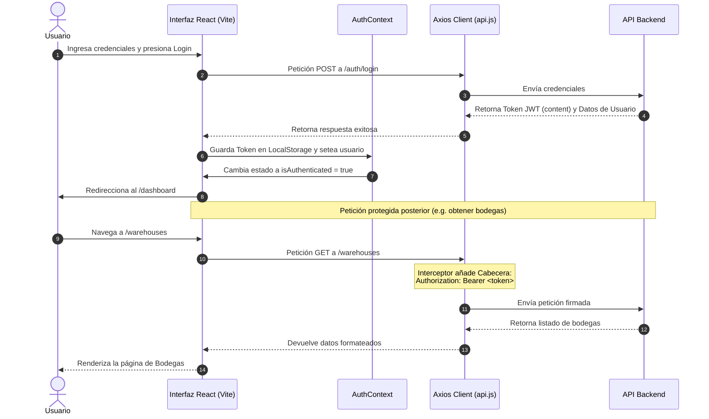

# LogisticsVision - Servicio Frontend 📦🛡️

Este repositorio contiene la aplicación frontend para **LogisticsVision**, un sistema integral de gestión logística, monitoreo de almacenes mediante cámaras y procesamiento de órdenes. Desarrollada con tecnologías modernas y reactivas para brindar una experiencia de usuario fluida, rápida y segura.

---

## 🛠️ Stack Tecnológico

El frontend está construido sobre las siguientes tecnologías y herramientas:

*   **Core**: [React 19](https://react.dev/) para la renderización de interfaces declarativas basadas en componentes y [Vite](https://vite.dev/) como herramienta de empaquetado ultra-rápida.
*   **Estilos**: [Tailwind CSS v4](https://tailwindcss.com/) integrado de forma nativa con Vite para la gestión de estilos responsivos y modulares a través de utilidades CSS.
*   **Biblioteca de UI**: [Material UI (MUI)](https://mui.com/) para proveer un conjunto consistente de iconos interactivos (`@mui/icons-material`).
*   **Enrutamiento**: [React Router DOM v7](https://reactrouter.com/) para el manejo del enrutamiento dinámico en el lado del cliente (SPA).
*   **Estado Global**: React Context API para la gestión del estado global de autenticación.
*   **Peticiones HTTP**: [Axios](https://axios-http.com/) para consumir los servicios backend con soporte para interceptores de solicitudes y respuestas.
*   **Visualización de Datos**: [Recharts](https://recharts.org/) para los gráficos analíticos e interactivos del Dashboard.
*   **Animaciones**: [Framer Motion](https://www.framer.com/motion/) para transiciones suaves y micro-interacciones de la interfaz.
*   **Validaciones**: [Zod](https://zod.dev/) y [React Hook Form](https://react-hook-form.com/) para la validación tipada y estructurada de formularios.
*   **Reportes**: [XLSX (SheetJS)](https://sheetjs.com/) para exportar las tablas directamente a documentos de Microsoft Excel.

---

## 📁 Estructura del Proyecto

El código fuente se organiza dentro de la carpeta `src` de la siguiente manera:

```text
src/
├── app/                 # Configuración principal: proveedores y rutas de la aplicación
├── assets/              # Archivos estáticos como imágenes y logotipos
├── components/          # Componentes visuales reutilizables (formularios, tablas, rutas)
├── containers/          # Layouts y envoltorios estructurales de la aplicación
├── context/             # Proveedores de estado global (e.g., AuthContext)
├── mocks/               # Datos simulados (mocks) para desarrollo sin backend
├── pages/               # Páginas completas asociadas a las rutas del enrutador
├── services/            # Capa de comunicación con el backend (peticiones Axios)
├── utils/               # Constantes del sistema, helpers y lógica de control de accesos
└── validations/         # Esquemas de validación basados en Zod
```

### Archivos de Configuración Clave
*   [App.jsx](file:///c:/Users/eduar/Desktop/tesis/Frontend-Service/src/App.jsx): Punto de entrada del árbol de componentes envuelto en los proveedores globales.
*   [main.jsx](file:///c:/Users/eduar/Desktop/tesis/Frontend-Service/src/main.jsx): Punto de montaje en el DOM e inicializador de configuraciones del entorno (como filtros de consola).
*   [vercel.json](file:///c:/Users/eduar/Desktop/tesis/Frontend-Service/vercel.json): Configuración de reglas de redirección para evitar fallos de ruta (404) al recargar el navegador en Vercel.

---

## 🧭 Flujo de Arquitectura y Seguridad

La aplicación cuenta con una arquitectura de seguridad y datos desacoplada que sigue el siguiente flujo de ejecución:



### 1. Autenticación y Persistencia
El estado de la sesión es administrado por el [AuthContext.jsx](file:///c:/Users/eduar/Desktop/tesis/Frontend-Service/src/context/AuthContext.jsx).
- Al iniciar sesión correctamente, el token JWT devuelto por el backend se almacena en el `localStorage` bajo la clave `token`.
- En cada recarga de la página, el contexto realiza una petición al endpoint `/auth/get-me` para validar la sesión actual y descargar el perfil con los roles correspondientes.

### 2. Interceptores de Axios
Configurados en [api.js](file:///c:/Users/eduar/Desktop/tesis/Frontend-Service/src/services/api.js):
*   **Request Interceptor**: Antes de enviar cualquier solicitud HTTP, extrae automáticamente el token del `localStorage` y lo inyecta como una cabecera de tipo `Bearer` (`Authorization: Bearer <token>`).
*   **Response Interceptor**: Escucha las respuestas del servidor. Si el backend responde con un código **401 Unauthorized** (token expirado o inválido) y existe una sesión activa, el cliente elimina inmediatamente el token del `localStorage`, vacía el estado del usuario y redirige al login de manera automática.

### 3. Control de Acceso Basado en Roles (RBAC)
Las rutas están definidas en [router.jsx](file:///c:/Users/eduar/Desktop/tesis/Frontend-Service/src/app/router.jsx) y protegidas utilizando el componente [ProtectedRoute.jsx](file:///c:/Users/eduar/Desktop/tesis/Frontend-Service/src/components/routes/ProtectedRoute.jsx).
- El componente `ProtectedRoute` extrae los roles del usuario con la función utilitaria `getUserRoleIds` de [accessControl.js](file:///c:/Users/eduar/Desktop/tesis/Frontend-Service/src/utils/accessControl.js).
- Si el rol del usuario actual no coincide con los roles autorizados para la ruta en cuestión (`allowedRoles`), es redirigido automáticamente a `/login`.
- **Roles definidos**:
  - `SUPERADMIN`: Control total de usuarios e inventario.
  - `ADMIN`: Gestión operativa general (tiendas, proveedores, bodegas, cámaras, productos).
  - `VIEWER-ORDER` / `VIEWER`: Roles enfocados a visualización y consulta.
  - `USER`: Rol operativo básico.

---

## 🌐 Variables de Entorno

La aplicación utiliza variables de entorno inyectadas en tiempo de compilación por Vite. Para definirlas localmente, cree un archivo `.env` o `.env.local` en la raíz del proyecto.

| Variable | Tipo | Por Defecto | Descripción |
| :--- | :--- | :--- | :--- |
| `VITE_API_URL` | String | `http://localhost:3000/api` | La dirección base del servidor backend de APIs. |
| `VITE_LOGS_ENABLED` | String | `"false"` | Activa o desactiva de forma global los registros de la consola (`console.log`, `info`, `warn`, `debug`) en el navegador. Útil para entornos de producción. |

> [!NOTE]
> En Vite, todas las variables de entorno de frontend deben llevar obligatoriamente el prefijo **`VITE_`** para poder ser expuestas al cliente a través de `import.meta.env`.

---

## 🔄 Integración con Otros Servicios

La aplicación está diseñada para operar de forma híbrida: puede conectarse a un backend en la nube/local o correr de forma independiente usando simulaciones de datos.

### 1. Servicios y Endpoints Consumidos
El frontend interactúa con las siguientes rutas de servicio backend configuradas en `src/services`:

*   **Autenticación (`/auth`)**: Login (`/auth/login`), registro (`/auth/register`) y validación de token (`/auth/get-me`).
*   **Usuarios (`/user`)**: Búsqueda (`/user/search`), detalles, actualización de estado y bloqueo de cuentas.
*   **Cámaras y Dispositivos (`/device`)**: Registro (`/device/register`), actualización y listados de cámaras IoT.
*   **Bodegas (`/warehouse`)**: Creación, edición, borrado y detalle específico de bodegas.
*   **Zonas/Ubicaciones (`/location`)**: Distribución física de áreas de almacenamiento.
*   **Órdenes (`/order`)**: Creación, actualización de estado (`PENDING`, `DISPATCHED`, `DELIVERED`, `CANCELLED`) y filtros de búsqueda.
*   **Escaneos (`/scan`)**: Registro de logs de lecturas QR/Barcodes en muelles de carga.
*   **Parámetros de Configuración (`/config-params`)**: Variables globales dinámicas de negocio.
*   **Automatización (`/automation`)**: Ejecución de análisis automatizados (procesamiento de imágenes de cámaras, alertas).

### 2. Mecanismo Híbrido de Fallback (Mocks)
Para facilitar el desarrollo del frontend de forma aislada (sin depender de que el backend esté encendido), las llamadas en la capa de servicios disponen de un mecanismo de **fallback** (conmutación por error) o mocks puros:
- Algunos endpoints están completamente mockeados de forma temporal llamando directamente a los módulos en `/mocks`.
- Otros, como el registro en [api.js](file:///c:/Users/eduar/Desktop/tesis/Frontend-Service/src/services/api.js#L115-L128), intentan la petición Axios real. Si esta falla debido a un error de red o de servidor apagado, se captura el error y retorna la simulación local de manera transparente, inyectando un indicador `fromMock: true` para advertir del origen de los datos.

---

## 🚀 Configuración de Despliegue y Uso

### Requisitos Previos
*   [Node.js](https://nodejs.org/) (Versión 18 o superior recomendada).
*   Gestor de paquetes `npm` (incluido con Node), `pnpm` o `yarn`.

### 1. Instalación de Dependencias
Descargue los paquetes requeridos por el proyecto ejecutando:
```bash
npm install
# o con pnpm
pnpm install
```

### 2. Ejecución en Desarrollo (Local)
Para iniciar el servidor de desarrollo de Vite con recarga rápida en tiempo real (HMR):
```bash
npm run dev
```
La aplicación estará disponible por defecto en `http://localhost:5173/`.

### 3. Compilación para Producción (Build)
Para compilar la aplicación optimizando el rendimiento (minificación de JS/CSS y optimización de assets):
```bash
npm run build
```
Esto generará los archivos de distribución listos para producción en el directorio `/dist`.

### 4. Previsualización de Compilación
Para verificar cómo se comporta la compilación de producción de forma local:
```bash
npm run preview
```

### 5. Despliegue en Vercel
Este proyecto está configurado para desplegarse de manera directa en la plataforma [Vercel](https://vercel.com). 

#### Redirección de Rutas SPA (`vercel.json`)
Dado que se trata de una Single Page Application (SPA), las peticiones de rutas secundarias (ejemplo: `/dashboard` o `/warehouses/123`) realizadas directamente en el navegador fallarán con un error 404 si el hosting intenta buscar el archivo físico en el servidor. 

Para resolver esto, el archivo [vercel.json](file:///c:/Users/eduar/Desktop/tesis/Frontend-Service/vercel.json) contiene la siguiente regla de reescritura:
```json
{
  "rewrites": [
    {
      "source": "/(.*)",
      "destination": "/index.html"
    }
  ]
}
```
Esto redirige todas las peticiones entrantes al archivo raíz `index.html` para que React Router se encargue del enrutamiento interno.

#### Pasos para desplegar:
1. Conecte su repositorio de GitHub a su panel de control en Vercel.
2. En la configuración del proyecto de Vercel, defina:
   - **Framework Preset**: `Vite` (se detectará automáticamente).
   - **Build Command**: `npm run build`.
   - **Output Directory**: `dist`.
3. Configure las variables de entorno en la interfaz de Vercel:
   - `VITE_API_URL` con la URL de producción de su backend.
   - `VITE_LOGS_ENABLED` en `"false"`.
4. Guarde y presione **Deploy**.
